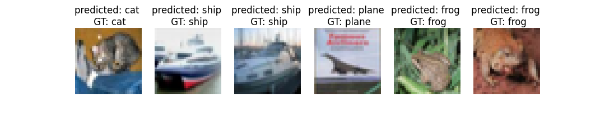

# wasp-learning-feature-representation-assign1
Course assignment. In this assignment, it tested the how pretraining network helps in general.

## pretrain on tiny imagenet data
Pretrainin network is to do reconstruction given the original images with randomly removing some pixels. 

```
python pretrain_tiny_imagenet.py
```
it saved the .pth file.


## fine tune on cifar-10 data
1. train from scratch
    ```
    train_cifar.py
    ```
2. train based on pretrained weight. If we want to use *pth/models_570.pth*.
    ```
    train_cifar.py --models_path pth/models_570.pth
    ```

3. train based on pretrained weight, but freeze the backbone weight.
    ```
    train_cifar.py --models_path pth/models_570.pth --freeze_backbone True
    ```
3. train on part of full size data, eg 5%. 
    ```
    train_cifar.py --models_path pth/models_570.pth --freeze_backbone True --fraction 5
    ```


